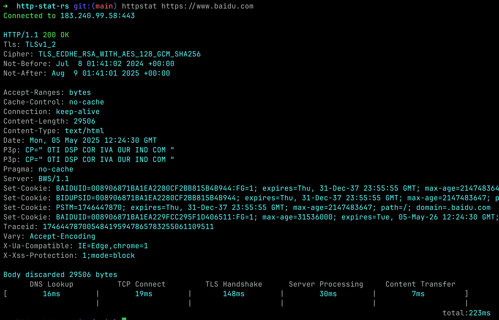

# http-stat-rs

Imitation is the sincerest form of flattery.

Pure rust version of http statistics, which refer to [httpstat](https://github.com/davecheney/httpstat).

- Supports http1, http2 and http3
- Default alpn is `h2, http/1.1`
- Supports multi compression: `gzip, br, zstd`
- Supports testing multiple IPs simultaneously for a specified domain


[中文](./README_zh.md)




## Release

[Pre-built binaries](https://github.com/vicanso/http-stat-rs/releases) for windows, macos and linux.

## Installation

```
cargo install http-stat
```


## Usage
```
httpstat --http3 https://cloudflare-quic.com/

httpstat --resolve=183.240.99.169,2409:8c54:870:310:0:ff:b0ed:40ac -s https://www.baidu.com/
```

## Features

```bash
httpstat visualizes curl(1) statistics in a way of beauty and clarity.

Usage: httpstat [OPTIONS] [URL_ARG]

Arguments:
  [URL_ARG]  url to request

Options:
  -u, --url <URL>          URL to request (optional, can be provided as the last argument)
  -H <HEADERS>             set HTTP header; repeatable: -H 'Accept: ...' -H 'Range: ...'
  -4                       resolve host to ipv4 only
  -6                       resolve host to ipv6 only
  -k                       skip verify tls certificate
  -o <OUTPUT>              output file
  -L                       follow 30x redirects
  -X <METHOD>              HTTP method to use (default GET)
  -d, --data <DATA>        the body of a POST or PUT request; from file use @filename
      --resolve <RESOLVE>  resolve the request host to specific ip address (e.g. 1.2.3.4,1.2.3.5)
      --compressed         request compressed response: gzip, br, zstd
      --http3              use http/3
      --http2              use http/2
      --http1              use http/1.1
  -s                       silent mode
  -h, --help               Print help
  -V, --version            Print version
```

## License

http-stats-rs is provided under the MIT license. See [LICENSE](LICENSE).
