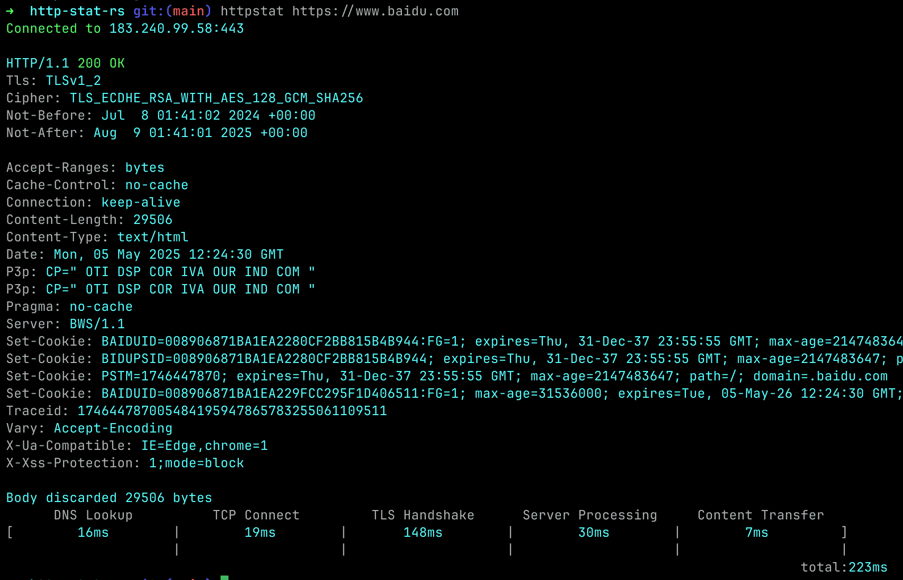

# http-stat-rs

Imitation is the sincerest form of flattery.

A **zero-dependency, single-binary** HTTP diagnostics tool written in pure Rust. Visualizes the full request lifecycle — DNS, TCP, TLS, server processing, content transfer — in one clear timeline. Inspired by [httpstat](https://github.com/davecheney/httpstat).

[中文](./README_zh.md)



## Highlights

- **HTTP/1.1, HTTP/2 & HTTP/3 (QUIC)** — first-class support for all modern protocols, switch with a single flag
- **gRPC** — `grpc://` / `grpcs://` with an empty path, `/`, or `grpc.health.v1.Health/Check` runs a health check; add `?service=NAME` to check one service instead of the whole server. Any other path is a raw unary RPC: the body is a length-prefixed protobuf frame (`-d` is raw protobuf, not JSON), and `grpc-status` comes from the trailers, which are listed under `Trailers:`. `grpcs://` performs a real rustls handshake (honoring `-k` and mTLS). `-K` and `-c` reuse one HTTP/2 connection for either kind of call
- **Request Send phase** — request body upload is timed separately from Server Processing, so a slow POST upload no longer hides as "server is slow"
- **Server-Timing inspection** — parses the `Server-Timing` response header (RFC 8673) and displays the server-reported breakdown *inside* TTFB (CDN edge vs origin vs worker, etc.)
- **Benchmark mode** — `-n 10` repeats N times with min/max/avg/p50/p95/p99. Each iteration still honors `--retry`, `--max-time`, and `--alt-svc`. `-K` reuses one connection, including HTTP/3. `-c N` keeps N HTTP/2 or HTTP/3 requests in flight (`-c 4 -n 20` is 20 requests, 4 at a time; `-c 4` alone runs 4). HTTP/1.1 cannot multiplex and runs `-c` one after another
- **Multi-IP concurrent testing** — `--resolve` tests multiple IPs in parallel, results sorted by success
- **Transparent decompression** — auto-decodes `gzip`, `br`, `zstd` responses with `--compressed`
- **Custom DNS** — specify DNS servers by IP or use built-in presets: `google`, `cloudflare`, `quad9`; DoH/DoT presets: `google-doh`, `cloudflare-doh`, `quad9-doh`, `google-dot`, `cloudflare-dot`, `quad9-dot`; or any other resolver as a DoH URL (`https://dns.example.com/dns-query`) or a DoT address (`tls://dns.example.com`)
- **International domain names** — a Unicode host in the URL (`https://münchen.de/`) is converted to Punycode before the request is made
- **DoH/DoT phase split** — when DoH or DoT is in use, the DNS column splits into `DNS Connect` (TCP+TLS to the resolver) and `DNS Query`, so you can tell whether "DoH is slow" means slow handshake to the resolver or slow query processing
- **Kernel TCP statistics** — on Linux, macOS, and Windows, samples TCP info right after connect and again after the response body is read. Shown under `--verbose` or with `--tcp-info`; surfaces RTT, MSS, cwnd, and retransmits during the request, which isolates "Content Transfer slow" into packet loss vs TCP slow start vs application latency. On Windows the retransmit counter is bytes (`BytesRetrans`), not segments. Through an HTTP/SOCKS proxy the sample reflects the client↔proxy socket, not the origin.
- **Download throughput with slow-start split** — for response bodies larger than 1 MiB, a `Throughput: X MB/s` line is shown next to `Body size`. Under `--verbose`, it also breaks down into "first 100 KB" vs "tail" so you can tell TCP slow-start–dominated downloads from servers that simply stream slowly the whole way.
- **Bilingual output (English / Simplified Chinese)** — `--lang en|zh` overrides the display language; when omitted, the locale is sniffed from `LC_ALL` / `LC_MESSAGES` / `LANG` (anything starting with `zh` → Chinese), with English as the safe fallback. JSON output keeps English keys so machine consumers aren't affected by user locale.
- **JSON output** — `--json` for scripting, CI/CD pipelines, and monitoring integration. The full output contract is documented in [JSON_SCHEMA.md](./JSON_SCHEMA.md), including exit codes, optional blocks, and ready-to-use `jq` recipes
- **TLS inspection** — verbose mode shows full certificate chain, cipher suite, SAN domains, and validity
- **TLS handshake diagnostics** — every HTTPS request reports whether the handshake was `Full` or `Resumed`, whether the server stapled an OCSP response, and (in `-n` benchmark mode, where runs 2+ can resume) whether 0-RTT early data was accepted
- **Cookie support** — `-b 'k=v'` or `-b @file`. `Set-Cookie` is stored with `Domain`, `Path`, `Secure`, `Max-Age`, and `Expires`, and only cookies that match the next hop are sent
- **Standards-correct redirects** — `-L` follows redirects up to `--max-redirs` (default 10; `0` does not follow). Relative `Location` values are resolved and dot segments removed. The method downgrades per RFC 9110 (303 → GET, 301/302 POST → GET, 307/308 preserved). `Authorization` and `--resolve` are dropped on a cross-host hop. Every hop's timings are kept, plus a wall-clock `chain_total`; `total` stays the last hop. A repeated method+URL is a loop (non-zero exit). Hitting the cap prints a stderr note and returns the last redirect response
- **ALPN negotiation display** — every response line shows the final protocol agreed between client and server (`HTTP/1.1`, `H2`, `H3`), so you always know which version was actually used
- **Alt-Svc auto-upgrade** — `--alt-svc` retries once over HTTP/3 when the response advertises `h3` (RFC 7838). A successful endpoint is remembered in `~/.httpstat/alt-svc.json` (`ma=0` is not stored). `-K` / `-c` probe once, uncounted, before the benchmark. A failed upgrade drops the cache entry and keeps the original result. `--http3` together with a proxy that is not bypassed is refused
- **JSON field selector** — `--jq '.items[].name'` extracts fields directly from the response body (supports `.a.b`, `.[0]`, `.[]`); an unsupported filter or a non-JSON body prints a clear error instead of silently dumping the full body
- **Pretty JSON** — `--pretty` formats the response body in-place; combine with `--jq` for focused, readable output
- **Response header filtering** — `--include-header` shows only the headers you care about; `--exclude-header` hides the noisy ones
- **curl-like UX** — familiar flags (`-H`, `-X`, `-d`, `-L`, `-k`, `-o`, `-4`/`-6`) for a smooth transition
- **Waterfall chart** — `--waterfall` renders each phase as a horizontal bar, making bottlenecks instantly visible (like Chrome DevTools Network panel)
- **`--connect-to`** — redirect `HOST1:PORT1` to `HOST2:PORT2` at the TCP level; TLS SNI and `Host` header stay unchanged, like curl's `--connect-to`
- **Proxy support** — `--proxy` for HTTP, HTTPS, and SOCKS5, including userinfo (`user:pass@host`). Also reads `HTTP_PROXY`, `HTTPS_PROXY`, `ALL_PROXY`, and skips origins listed in `NO_PROXY` / `no_proxy`. `-k` applies to the proxy certificate as well as the origin
- **Source IP binding** — `--bind <IP>` pins outbound connections to a specific local address; essential for multi-NIC hosts, policy routing, or validating which interface reaches a target
- **mTLS (mutual TLS)** — `--cert`/`--key` sends a client certificate for zero-trust and service mesh authentication
- **Config file** — `~/.httpstatrc` sets persistent defaults (DNS, timeout, headers, etc.); CLI flags always win
- **Fine-grained timeouts** — `--timeout` caps every phase, including the wait for response headers and the body transfer, so a server that accepts the connection but never answers can't hang the process; `--connect-timeout` bounds only the connection phase (DNS + TCP + TLS/QUIC); `--max-time` is one wall-clock budget for the whole operation, including the body, redirects, retries, backoff, and an Alt-Svc upgrade
- **Automatic retry** — `--retry N` retries transient failures (timeouts, connection errors, HTTP 408/429/500/502/503/504) with exponential backoff, or a fixed `--retry-delay`; ideal for flaky CI gates
- **Response body cap** — `--max-filesize` aborts any transfer over the limit (default 1GB, `0` = unlimited). `-o` streams the decoded body to disk when `--jq` and `--pretty` are not set and the run is a single request; otherwise the body is buffered. Decompression time is reported on its own and is not folded into Content Transfer
- **Semantic exit codes** — distinct codes for DNS, TCP, TLS, timeout, 4xx, 5xx failures for easy scripting
- **Tiny binary** — release build uses LTO + `opt-level=z` + strip, typically < 5 MB
- **Truly zero system dependencies** — statically linked, no libcurl, no OpenSSL, no libc on musl builds; drop the binary directly into a `scratch` or `alpine` Docker image for production diagnostics

## Installation

### One-line install (Linux & macOS)

```bash
curl -fsSL https://raw.githubusercontent.com/vicanso/http-stat-rs/main/install.sh | sh
```

### Pre-built binaries

[Pre-built binaries](https://github.com/vicanso/http-stat-rs/releases) for Windows, macOS and Linux.

```bash
# Linux
curl -L https://github.com/vicanso/http-stat-rs/releases/latest/download/httpstat-linux-musl-$(uname -m).tar.gz | tar -xzf -
sudo mv httpstat /usr/local/bin/

# macOS
curl -L https://github.com/vicanso/http-stat-rs/releases/latest/download/httpstat-darwin-$(uname -m).tar.gz | tar -xzf -
sudo mv httpstat /usr/local/bin/
```

### From source

```bash
cargo install http-stat
```

## Request Lifecycle

Every HTTP request goes through up to six sequential phases. httpstat measures each one independently:

```
  DNS Lookup   TCP Connect  TLS Handshake  Request Send  Server Processing  Content Transfer
[────────────][────────────][──────────────][────────────][──────────────────][───────────────]
      │              │              │             │                │                  │
  hostname       3-way SYN      TLS/SSL      headers +         waiting for       downloading
   → IP          handshake    negotiation    request body       first byte         response
                                 (HTTPS)      on the wire
                                                                                          ▲
                                                                              Total = all phases
```

| Phase | What it measures |
|---|---|
| DNS Lookup | Time to resolve the hostname to an IP address |
| TCP Connect | Time for the 3-way TCP handshake |
| TLS Handshake | Time to negotiate the TLS session (HTTPS/HTTP2/HTTP3 only) |
| Request Send | Time to write request headers and body to the transport — matters for POST/PUT uploads |
| Server Processing | Time from the last request byte sent to the first response byte received — pure server latency |
| Content Transfer | Time to download the complete response body |

> For HTTP/3, **QUIC Connect** replaces both TCP Connect and TLS Handshake (QUIC combines transport and crypto in a single handshake).

If the server emits a `Server-Timing` response header, httpstat parses it and displays the server-reported sub-phases right above the timeline — useful for splitting a slow Server Processing into CDN edge / origin / worker components without leaving the terminal.

## Usage

```bash
# Basic — auto-negotiates HTTP/2 via ALPN
httpstat https://www.cloudflare.com/

# HTTP/3 (QUIC) with compressed response
httpstat --http3 --compressed https://cloudflare-quic.com/

# Auto-upgrade to HTTP/3 when the server advertises it via Alt-Svc
httpstat --alt-svc https://cloudflare.com

# Test multiple IPs concurrently in silent mode
httpstat --resolve=183.240.99.169,2409:8c54:870:310:0:ff:b0ed:40ac -s https://www.baidu.com/

# POST with request body from file
httpstat -X POST -d @payload.json -H 'Content-Type: application/json' https://httpbin.org/post

# POST with request body from stdin
echo '{"key":"value"}' | httpstat -X POST -d @- -H 'Content-Type: application/json' https://httpbin.org/post

# gRPC health check
httpstat grpc://localhost:50051

# gRPC health check for one service
httpstat 'grpc://localhost:50051/?service=my.pkg.Service'

# Verbose mode — full cert chain + request headers
httpstat -v https://github.com

# JSON output for scripting
httpstat --json https://example.com

# JSON benchmark output (pipe to jq, etc.)
httpstat --json -n 5 https://example.com

# Send cookies
httpstat -b 'session=abc123; lang=en' https://httpbin.org/cookies

# Custom DNS server (plain UDP)
httpstat --dns-servers=cloudflare https://example.com

# DNS-over-HTTPS
httpstat --dns-servers=cloudflare-doh https://example.com

# DNS-over-TLS
httpstat --dns-servers=google-dot https://example.com

# Any other DoH or DoT resolver
httpstat --dns-servers=https://dns.example.com/dns-query https://example.com
httpstat --dns-servers=tls://dns.example.com https://example.com

# Pretty-print JSON response
httpstat --pretty https://httpbin.org/get

# Benchmark — repeat 10 times, show percentile stats
httpstat -n 10 https://example.com

# Benchmark with connection reuse — measure warm request latency
httpstat -n 10 -K https://example.com

# HTTP/2 multiplex — 20 requests, 4 in flight on one connection
httpstat -c 4 -n 20 https://example.com

# HTTP/3 with connection reuse
httpstat --http3 -n 10 -K https://cloudflare-quic.com/

# Follow at most 3 redirects
httpstat -L --max-redirs 3 https://example.com

# Stream the decoded body to a file (single request, no --jq / --pretty)
httpstat --compressed -o page.html https://example.com

# Only show specific response headers
httpstat --include-header content-type --include-header server https://example.com

# Hide noisy response headers
httpstat --exclude-header date --exclude-header via https://example.com

# Set a timeout for every phase
httpstat --timeout 5s https://example.com

# Bound only the connection phase, plus an overall wall-clock cap
httpstat --connect-timeout 3s --max-time 30s https://example.com

# Retry transient failures with exponential backoff (great for CI gates)
httpstat --retry 3 https://example.com

# Retry with a fixed delay instead of backoff
httpstat --retry 5 --retry-delay 2s https://example.com

# Abort if the response body exceeds 10MB (default cap is 1GB)
httpstat --max-filesize 10MB https://example.com/big.bin

# mTLS — send client certificate
httpstat --cert client.crt --key client.key https://mtls.example.com

# Waterfall bar chart — spot bottlenecks at a glance
httpstat --waterfall https://example.com

# Connect-to: test a specific backend without changing DNS or Host header
httpstat --connect-to example.com:443:staging.internal:443 https://example.com

# Repeatable for multiple overrides
httpstat --connect-to api.example.com:443:192.168.1.10:8443 https://api.example.com

# HTTP proxy
httpstat --proxy http://proxy.corp:8080 https://example.com

# SOCKS5 proxy
httpstat --proxy socks5://127.0.0.1:1080 https://example.com

# Proxy from environment variable
HTTPS_PROXY=http://proxy.corp:8080 httpstat https://example.com

# Bind to a specific local IP (multi-NIC / policy routing)
httpstat --bind 192.168.1.100 https://example.com
```

## Options

```
httpstat visualizes curl(1) statistics in a way of beauty and clarity.

Usage: httpstat [OPTIONS] [URL_ARG]

Arguments:
  [URL_ARG]  url to request

Options:
  -u, --url <URL>                  URL to request (optional, can be provided as the last argument)
  -H <HEADERS>                     set HTTP header; repeatable: -H 'Accept: ...' -H 'Range: ...'
  -4                               resolve host to ipv4 only
  -6                               resolve host to ipv6 only
  -k                               skip verify tls certificate
  -o <OUTPUT>                      output file
  -L                               follow 30x redirects
      --max-redirs <MAX_REDIRS>    max redirects to follow with -L (default 10); 0 does not follow
  -X <METHOD>                      HTTP method to use (default GET)
  -d, --data <DATA>                request body; without -X this implies POST; from file use @filename, from stdin use @-
      --resolve <RESOLVE>          resolve the request host to specific ip address (e.g. 1.2.3.4,1.2.3.5)
      --compressed                 request compressed response: gzip, br, zstd
      --http3                      use http/3
      --http2                      use http/2
      --http1                      use http/1.1
      --alt-svc                    if the response advertises HTTP/3 via Alt-Svc, retry once over h3
  -s                               silent mode, only output the connect address and result
      --dns-servers <DNS_SERVERS>  dns servers to use: IPs (8.8.8.8,8.8.4.4), a preset (google, cloudflare, quad9, or one with -doh / -dot appended), a DoH URL (https://dns.example.com/dns-query) or a DoT address (tls://dns.example.com)
  -v, --verbose                    verbose mode
      --pretty                     pretty mode
      --waterfall                  show timing as a waterfall bar chart
      --tcp-info                   show kernel TCP_INFO stats (RTT, cwnd, retransmits); Linux, macOS, and Windows
      --lang <LANG>                display language: en | zh (default: system)
      --timeout <TIMEOUT>          timeout for every phase (DNS, TCP, TLS, request, QUIC)
      --connect-timeout <DUR>      max time for the connection phase only (DNS + TCP + TLS/QUIC), e.g. 5s
      --max-time <DUR>             overall time limit for the whole operation, including body, redirects, retries, and Alt-Svc, e.g. 30s
      --retry <RETRY>              retry up to N times on transient failure (timeout, conn error, 408/429/5xx)
      --retry-delay <DUR>          fixed delay between retries (e.g. 2s); default is exponential backoff
      --max-filesize <SIZE>        max response body size to buffer, e.g. 100MB (default 1GB); 0 = unlimited
  -n, --count <COUNT>              number of requests for benchmarking, show min/max/avg/p50/p95/p99 stats
  -K, --reuse                      reuse one connection across -n requests (HTTP/3 included); -c also reuses
  -c, --concurrency <N>            in-flight requests on one HTTP/2 or HTTP/3 connection; if -n is omitted, -c N runs N requests
  -b, --cookie <COOKIE>            send cookies: 'name=value; name2=value2' or from file use @filename
      --json                       output results as JSON for scripting and CI/CD
      --connect-to <CONNECT_TO>    redirect HOST1:PORT1 to HOST2:PORT2 (repeatable); TLS SNI and Host header stay unchanged
      --proxy <PROXY>              proxy URL: http://host:port, https://host:port, socks5://host:port
      --cert <CERT>                client certificate for mTLS (PEM file)
      --key <KEY>                  client private key for mTLS (PEM file)
      --bind <BIND>                bind to a specific local IP address (e.g. 192.168.1.100 or ::1)
      --jq <JQ>                    filter JSON response body with a jq-style selector (e.g. ".items[].name")
      --include-header <HEADER>    only show these response headers (repeatable, case-insensitive)
      --exclude-header <HEADER>    hide these response headers (repeatable, case-insensitive)
  -h, --help                       Print help
  -V, --version                    Print version
```

## Config File (`~/.httpstatrc`)

Set persistent defaults so you don't have to repeat flags on every invocation.

Create `~/.httpstatrc` as a JSON object — any field can be omitted. CLI flags always override config values.

```json
{
  "compressed": true,
  "dns_servers": "cloudflare",
  "timeout": "10s",
  "connect_timeout": "5s",
  "max_time": "30s",
  "retry": 3,
  "retry_delay": "2s",
  "max_filesize": "1GB",
  "verbose": false,
  "pretty": false,
  "silent": false,
  "follow_redirect": false,
  "skip_verify": false,
  "http1": false,
  "http2": false,
  "http3": false,
  "alt_svc": false,
  "json": false,
  "waterfall": false,
  "tcp_info": false,
  "reuse": false,
  "lang": "en",
  "proxy": "http://proxy.example:8080",
  "bind": "127.0.0.1",
  "connect_to": ["example.com:443:127.0.0.1:8443"],
  "concurrency": 4,
  "max_redirs": 10,
  "headers": ["Accept: application/json"],
  "include_header": [],
  "exclude_header": ["date", "via"]
}
```

## Exit Codes

| Code | Meaning |
|------|---------|
| 0 | Success |
| 1 | General / unknown error |
| 2 | DNS resolution failure |
| 3 | TCP connection failure |
| 4 | TLS / SSL error |
| 5 | Timeout |
| 6 | HTTP 4xx client error |
| 7 | HTTP 5xx server error |

A gRPC call succeeds only when `grpc-status` is `0`. HTTP 200 with any other grpc-status exits `1`; a raw unary call leaves `error` unset, a health check sets it to the reason.

## License

http-stat-rs is provided under the MIT license. See [LICENSE](LICENSE).
