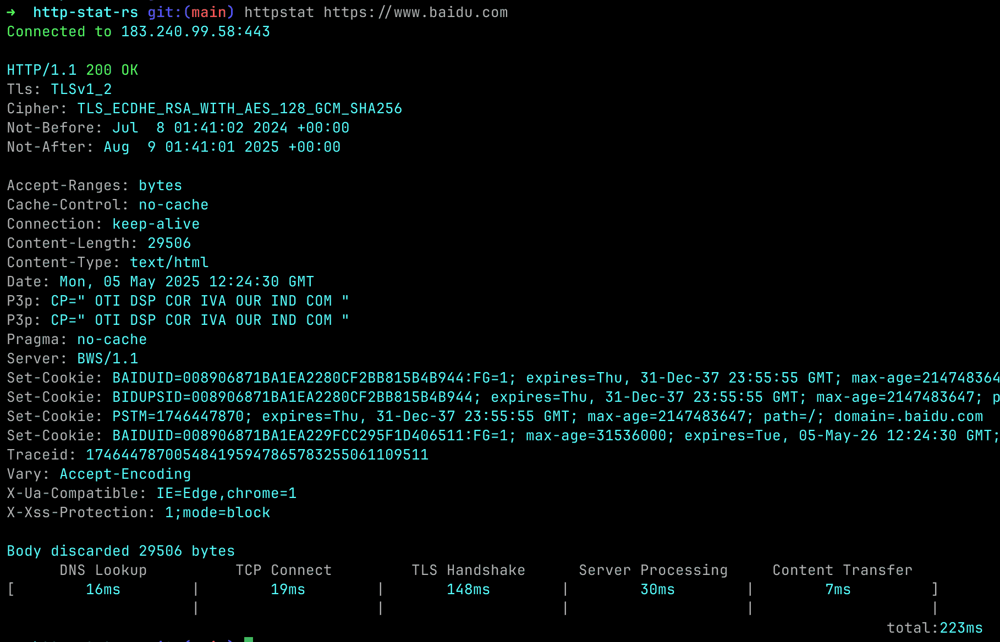

# http-stat-rs

模仿是最真诚的致敬。

纯 Rust 编写的**零依赖、单二进制**HTTP 诊断工具。一条命令可视化完整请求生命周期 — DNS 解析、TCP 连接、TLS 握手、服务端处理、内容传输 — 一目了然。参考了 [httpstat](https://github.com/davecheney/httpstat)。



## 亮点

- **HTTP/1.1、HTTP/2 和 HTTP/3 (QUIC)** — 全面支持现代协议，一个参数即可切换
- **gRPC 健康检查** — 使用 `grpc://` 或 `grpcs://` 协议直接探测 gRPC 服务
- **基准测试模式** — `-n 10` 重复 N 次输出 min/max/avg/p50/p95/p99；加 `-K` 复用连接，对比冷启动与热请求延迟
- **多 IP 并发测试** — `--resolve` 同时测试多个 IP，结果按成功/失败排序
- **透明解压** — `--compressed` 自动解码 `gzip`、`br`、`zstd` 响应
- **自定义 DNS** — 指定 DNS 服务器 IP 或使用内置预设：`google`、`cloudflare`、`quad9`；DoH/DoT 预设：`google-doh`、`cloudflare-doh`、`quad9-doh`、`google-dot`、`cloudflare-dot`、`quad9-dot`
- **JSON 输出** — `--json` 方便脚本集成、CI/CD 流水线和监控系统对接
- **TLS 证书检查** — verbose 模式展示完整证书链、密码套件、SAN 域名及有效期
- **Cookie 支持** — `-b 'k=v'` 或 `-b @file`，配合 `-L` 重定向自动合并 `Set-Cookie`
- **ALPN 协议协商展示** — 每次响应明确显示客户端与服务端最终协商出的协议版本（`HTTP/1.1`、`H2`、`H3`），清楚知道实际使用了哪个版本
- **JSON 字段选择器** — `--jq '.items[].name'` 直接从响应体提取所需字段，无需额外管道 `jq`
- **JSON 格式化输出** — `--pretty` 原地美化响应体；配合 `--jq` 使用，输出更聚焦、更易读
- **响应头过滤** — `--include-header` 只显示关注的响应头；`--exclude-header` 隐藏噪音字段
- **curl 风格操作** — 熟悉的参数（`-H`、`-X`、`-d`、`-L`、`-k`、`-o`、`-4`/`-6`），无缝上手
- **Waterfall 图表** — `--waterfall` 将每个阶段渲染为横向进度条，瓶颈一目了然（类似 Chrome DevTools Network 面板）
- **`--connect-to`** — 在 TCP 层将 `HOST1:PORT1` 重定向到 `HOST2:PORT2`，TLS SNI 和 `Host` 头保持不变，与 curl 的 `--connect-to` 一致
- **代理支持** — `--proxy` 支持 HTTP/HTTPS/SOCKS5 代理；同时读取 `HTTP_PROXY`、`HTTPS_PROXY`、`ALL_PROXY` 环境变量
- **源 IP 绑定** — `--bind <IP>` 将出站连接绑定到指定本地地址，多网卡环境、策略路由或验证特定网卡可达性时不可或缺
- **mTLS（双向 TLS）** — `--cert`/`--key` 发送客户端证书，适用于零信任网络和服务网格
- **配置文件** — `~/.httpstatrc` 设置持久化默认值（DNS、超时、请求头等），CLI 参数始终优先
- **语义化退出码** — DNS、TCP、TLS、超时、4xx、5xx 各有独立退出码，脚本判断更便捷
- **极小体积** — release 构建采用 LTO + `opt-level=z` + strip，通常 < 5 MB
- **真正的零系统依赖** — 静态链接，不依赖 libcurl、OpenSSL 或 libc（musl 构建），可直接放入 `scratch` 或 `alpine` Docker 镜像用于生产环境排查

## 安装

### 一键安装（Linux & macOS）

```bash
curl -fsSL https://raw.githubusercontent.com/vicanso/http-stat-rs/main/install.sh | sh
```

### 预编译二进制

为 Windows、macOS 和 Linux 提供[预编译二进制文件](https://github.com/vicanso/http-stat-rs/releases)。

```bash
# Linux
curl -L https://github.com/vicanso/http-stat-rs/releases/latest/download/httpstat-linux-musl-$(uname -m).tar.gz | tar -xzf -
sudo mv httpstat /usr/local/bin/

# macOS
curl -L https://github.com/vicanso/http-stat-rs/releases/latest/download/httpstat-darwin-$(uname -m).tar.gz | tar -xzf -
sudo mv httpstat /usr/local/bin/
```

### 从源码安装

```bash
cargo install http-stat
```

## 请求生命周期

每个 HTTP 请求最多经历五个串行阶段，httpstat 对每个阶段单独计时：

```
  DNS 解析     TCP 连接     TLS 握手      服务端处理       内容传输
[────────────][────────────][──────────────][──────────────────][───────────────]
      │              │              │                │                  │
  域名解析       三次握手        TLS/SSL         等待首字节           下载响应
  → IP 地址    SYN 交换       协商加密         （纯服务延迟）          正文
                             （仅 HTTPS）
                                                                         ▲
                                                              Total = 所有阶段之和
```

| 阶段 | 含义 |
|---|---|
| DNS 解析 | 将域名解析为 IP 地址所花费的时间 |
| TCP 连接 | 完成三次握手建立 TCP 连接的时间 |
| TLS 握手 | 协商 TLS 会话的时间（仅 HTTPS/HTTP2/HTTP3） |
| 服务端处理 | 从发出最后一个请求字节到收到第一个响应字节的时间——纯服务器延迟 |
| 内容传输 | 下载完整响应正文的时间 |

> HTTP/3 中，**QUIC 连接**阶段取代了 TCP 连接和 TLS 握手（QUIC 将传输层与加密握手合并为一步完成）。

## 使用示例

```bash
# 基础用法 — 通过 ALPN 自动协商 HTTP/2
httpstat https://www.cloudflare.com/

# HTTP/3 (QUIC) + 压缩响应
httpstat --http3 --compressed https://cloudflare-quic.com/

# 多 IP 并发测试，静默模式
httpstat --resolve=183.240.99.169,2409:8c54:870:310:0:ff:b0ed:40ac -s https://www.baidu.com/

# POST 请求，从文件读取请求体
httpstat -X POST -d @payload.json -H 'Content-Type: application/json' https://httpbin.org/post

# POST 请求，从 stdin 读取请求体
echo '{"key":"value"}' | httpstat -X POST -d @- -H 'Content-Type: application/json' https://httpbin.org/post

# gRPC 健康检查
httpstat grpc://localhost:50051

# 详细模式 — 展示完整证书链和请求头
httpstat -v https://github.com

# JSON 输出，方便脚本处理
httpstat --json https://example.com

# JSON 基准测试输出（可配合 jq 使用）
httpstat --json -n 5 https://example.com

# 发送 Cookie
httpstat -b 'session=abc123; lang=en' https://httpbin.org/cookies

# 指定 DNS 服务器（明文 UDP）
httpstat --dns-servers=cloudflare https://example.com

# DNS-over-HTTPS
httpstat --dns-servers=cloudflare-doh https://example.com

# DNS-over-TLS
httpstat --dns-servers=google-dot https://example.com

# JSON 响应格式化输出
httpstat --pretty https://httpbin.org/get

# 基准测试 — 重复 10 次，输出百分位统计
httpstat -n 10 https://example.com

# 连接复用基准测试 — 测量热请求延迟
httpstat -n 10 -K https://example.com

# 只显示指定响应头
httpstat --include-header content-type --include-header server https://example.com

# 隐藏特定响应头
httpstat --exclude-header date --exclude-header via https://example.com

# 设置超时时间
httpstat --timeout 5s https://example.com

# mTLS — 发送客户端证书
httpstat --cert client.crt --key client.key https://mtls.example.com

# Waterfall 图表 — 一眼看出瓶颈所在
httpstat --waterfall https://example.com

# connect-to：测试指定后端，不影响 DNS 或 Host 头
httpstat --connect-to example.com:443:staging.internal:443 https://example.com

# 可重复指定多个重定向规则
httpstat --connect-to api.example.com:443:192.168.1.10:8443 https://api.example.com

# HTTP 代理
httpstat --proxy http://proxy.corp:8080 https://example.com

# SOCKS5 代理
httpstat --proxy socks5://127.0.0.1:1080 https://example.com

# 从环境变量读取代理
HTTPS_PROXY=http://proxy.corp:8080 httpstat https://example.com

# 绑定指定本地 IP（多网卡 / 策略路由）
httpstat --bind 192.168.1.100 https://example.com
```

## 选项

```
httpstat 以美观清晰的方式展示 curl(1) 的统计信息。

用法: httpstat [选项] [URL参数]

参数:
  [URL参数]  要请求的 URL

选项:
  -u, --url <URL>                  要请求的 URL（可选，可以作为最后一个参数提供）
  -H <HEADERS>                     设置 HTTP 头；可重复使用：-H 'Accept: ...' -H 'Range: ...'
  -4                               仅使用 IPv4 解析主机
  -6                               仅使用 IPv6 解析主机
  -k                               跳过 TLS 证书验证
  -o <OUTPUT>                      输出文件
  -L                               跟随 30x 重定向
  -X <METHOD>                      使用的 HTTP 方法（默认为 GET）
  -d, --data <DATA>                POST 或 PUT 请求的请求体；从文件读取使用 @filename，从 stdin 读取使用 @-
      --resolve <RESOLVE>          解析域名到指定 IP（例如 1.2.3.4,1.2.3.5）
      --compressed                 请求压缩响应：gzip, br, zstd
      --http3                      使用 HTTP/3
      --http2                      使用 HTTP/2
      --http1                      使用 HTTP/1.1
  -s                               静默模式，仅输出连接地址和结果
      --dns-servers <DNS_SERVERS>  指定 DNS 服务器，格式：8.8.8.8,8.8.4.4；预设：google、cloudflare、quad9、google-doh、cloudflare-doh、quad9-doh、google-dot、cloudflare-dot、quad9-dot
  -v, --verbose                    详细模式
      --pretty                     格式化输出模式
      --timeout <TIMEOUT>          超时时间
  -n, --count <COUNT>              基准测试请求次数，输出 min/max/avg/p50/p95/p99 统计
  -K, --reuse                      基准测试中复用连接（需配合 -n），测试热请求性能
  -b, --cookie <COOKIE>            发送 Cookie：'name=value; name2=value2' 或从文件读取 @filename
      --json                       以 JSON 格式输出结果，方便脚本和 CI/CD 使用
      --include-header <HEADER>    只显示指定响应头（可重复，不区分大小写）
      --exclude-header <HEADER>    隐藏指定响应头（可重复，不区分大小写）
      --proxy <PROXY>              代理 URL：http://host:port、https://host:port、socks5://host:port
      --cert <CERT>                mTLS 客户端证书（PEM 文件）
      --key <KEY>                  mTLS 客户端私钥（PEM 文件）
  -h, --help                       显示帮助信息
  -V, --version                    显示版本信息
```

## 配置文件（`~/.httpstatrc`）

设置持久化默认值，避免每次输入重复参数。

创建 `~/.httpstatrc`，内容为 JSON 对象，所有字段均可省略。CLI 参数始终覆盖配置文件中的值。

```json
{
  "compressed": true,
  "dns_servers": "cloudflare",
  "timeout": "10s",
  "verbose": false,
  "pretty": false,
  "silent": false,
  "follow_redirect": false,
  "skip_verify": false,
  "http1": false,
  "http2": false,
  "http3": false,
  "json": false,
  "headers": ["Accept: application/json"],
  "include_header": [],
  "exclude_header": ["date", "via"]
}
```

## 退出码

| 退出码 | 含义 |
|--------|------|
| 0 | 成功 |
| 1 | 通用 / 未知错误 |
| 2 | DNS 解析失败 |
| 3 | TCP 连接失败 |
| 4 | TLS / SSL 错误 |
| 5 | 超时 |
| 6 | HTTP 4xx 客户端错误 |
| 7 | HTTP 5xx 服务端错误 |

## 许可证

http-stat-rs 使用 MIT 许可证。详见 [LICENSE](LICENSE)。
