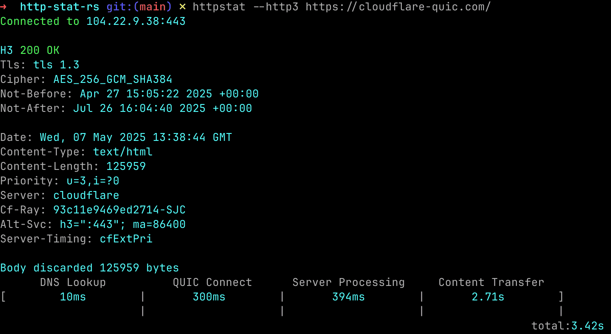

# http-stat-rs

模仿是最真诚的致敬。

纯 Rust 版本的 HTTP 统计工具，参考了 [httpstat](https://github.com/davecheney/httpstat)。

- 支持http1， http2 以及 http3
- 默认的alpn是 `h2, http/1.1`
- 支持多种压缩算法：`gzip, br, zstd`
- 允许指定域名对应多个ip同时检测



## 发布版本

为 Windows、macOS 和 Linux 提供[预编译二进制文件](https://github.com/vicanso/http-stat-rs/releases)。

```bash
## linux
curl -L https://github.com/vicanso/http-stat-rs/releases/latest/download/httpstat-linux-musl-$(uname -m).tar.gz | tar -xzf -
sudo mv httpstat /usr/local/bin/

## macos
curl -L https://github.com/vicanso/http-stat-rs/releases/latest/download/httpstat-darwin-$(uname -m).tar.gz | tar -xzf -
sudo mv httpstat /usr/local/bin/
```

## 安装

```
cargo install http-stat
```

## 使用方法
```
httpstat --http3 https://cloudflare-quic.com/

httpstat --resolve=183.240.99.169,2409:8c54:870:310:0:ff:b0ed:40ac -s https://www.baidu.com/
```

## 功能特性

```bash
httpstat 以美观清晰的方式展示 curl(1) 的统计信息。

用法: httpstat [选项] [URL参数]

参数:
  [URL参数]  要请求的 URL

选项:
  -u, --url <URL>          要请求的 URL（可选，可以作为最后一个参数提供）
  -H <HEADERS>             设置 HTTP 头；可重复使用：-H 'Accept: ...' -H 'Range: ...'
  -4                       仅使用 IPv4 解析主机
  -6                       仅使用 IPv6 解析主机
  -k                       跳过 TLS 证书验证
  -o <OUTPUT>              输出文件
  -L                       跟随 30x 重定向
  -X <METHOD>              使用的 HTTP 方法（默认为 GET）
  -d, --data <DATA>        POST 或 PUT 请求的请求体；从文件读取使用 @文件名
      --resolve <RESOLVE>  解析域名到指定ip(e.g. 1.2.3.4,1.2.3.5)
      --http3              使用 HTTP/3
      --http2              使用 HTTP/2
  -s                       安静模式，输入更少的数据
  -h, --help               显示帮助信息
  -V, --version            显示版本信息
```

## 许可证

http-stats-rs 使用 MIT 许可证。详见 [LICENSE](LICENSE)。
